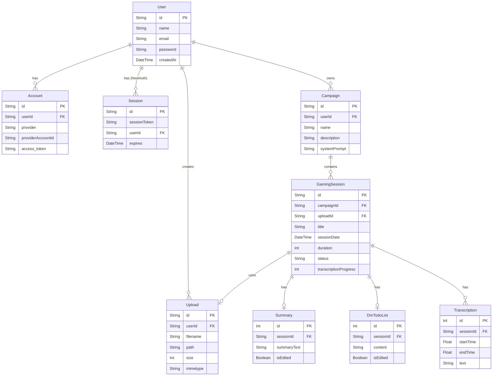

# Database Schema Analysis

## Current Schema Diagram



## Issues Identified

### 1. Naming Confusion
- **Problem**: `Session` model is NextAuth's authentication session (login tokens), but it's easily confused with game sessions
- **Impact**: Developers might use wrong model, hard to understand codebase
- **Solution**:
  - Keep `Session` name (NextAuth convention)
  - Add comments to clarify
  - Consider renaming `GamingSession` to something more distinct like `GameSession` or `PlaySession`

### 2. Missing Direct User Access
- **Problem**: `GamingSession` has no direct `userId` field
- **Current path**: `GamingSession → Campaign → User` (two joins)
- **Impact**:
  - Slower queries for user access control
  - More complex authorization logic
  - Cannot easily query "all gaming sessions for a user across campaigns"
- **Solution**: Add computed `userId` or accept the indirection

### 3. Redundant/Deprecated Fields
- **Problem**: `GamingSession.audioFilePath` marked "for backwards compatibility"
- **Impact**: Confusion about which field to use, potential data inconsistency
- **Solution**: Remove deprecated field, use only `Upload` relationship

### 4. Upload Cascade Behavior
- **Problem**: When `GamingSession` is deleted, `uploadId` is set to NULL (`onDelete: SetNull`)
- **Impact**: Orphaned upload files that serve no purpose
- **Question**: Should uploads be reusable? If not, should cascade delete

### 5. Unused Fields
- **Potential**: `Summary.keyEvents` and `Summary.charactersInvolved` might not be used
- **Action**: Check if these fields are populated/displayed anywhere

## Current Table Relationships

### Authentication (NextAuth)
- `User` ← core user identity
- `Account` → OAuth provider accounts (Google, Discord, etc.)
- `Session` → Active login sessions (session tokens)
- `VerificationToken` → Email verification tokens

### Application Domain
- `User` → `Campaign` (1:many) - Users own campaigns
- `Campaign` → `GamingSession` (1:many) - Campaigns have game sessions
- `User` → `Upload` (1:many) - Users upload audio files
- `Upload` → `GamingSession` (1:many) - Uploads can be used in multiple sessions
- `GamingSession` → `Transcription` (1:many) - Sessions have transcription segments
- `GamingSession` → `Summary` (1:1) - Sessions have one summary
- `GamingSession` → `DmTodoList` (1:1) - Sessions have one TODO list

## Data Access Patterns

### User Access Control
**Current approach**: Must join through Campaign
```typescript
// Check if user can access gaming session
const session = await prisma.gamingSession.findUnique({
  where: { id },
  include: { campaign: true }
});
if (session.campaign.userId !== user.id) throw new Error('Unauthorized');
```

**Alternative**: Add userId to GamingSession (denormalized but faster)
```typescript
// Direct check
const session = await prisma.gamingSession.findUnique({
  where: { id, userId: user.id }
});
if (!session) throw new Error('Unauthorized');
```

## Recommendations

### High Priority

1. **Add comments to schema** - Clarify that `Session` is NextAuth, not game sessions

2. **Remove deprecated field** - Delete `GamingSession.audioFilePath`
   - Requires data migration
   - Update all code references

3. **Review upload cascade behavior** - Decide if uploads should be:
   - Cascade deleted (if single-use)
   - Set null (if reusable)
   - Current: Set null

### Medium Priority

4. **Consider userId on GamingSession** - Add for performance
   - Denormalized but common pattern
   - Dramatically simplifies authorization
   - Improves query performance

5. **Audit unused fields** - Check if these are used:
   - `Summary.keyEvents`
   - `Summary.charactersInvolved`
   - `Upload.chunkPaths`
   - `Upload.status` enum values

### Low Priority

6. **Rename GamingSession?** - Consider more distinct name:
   - `GameSession`
   - `PlaySession`
   - Keep current (least disruptive)

7. **Standardize ID types** - Mix of String (cuid) and Int (autoincrement)
   - User/Campaign/Upload/GamingSession: String (cuid)
   - Transcription/Summary/DmTodoList: Int (autoincrement)
   - Consider standardizing (breaking change)

## Proposed Improved Schema

```prisma
// Add userId to GamingSession for direct access
model GamingSession {
  id             String          @id @default(cuid())
  userId         String          @map("user_id")  // NEW: Direct user reference
  campaignId     String          @map("campaign_id")
  title          String
  sessionDate    DateTime        @map("session_date")
  uploadId       String?         @map("upload_id")
  // REMOVED: audioFilePath
  duration       Int?
  status         String          @default("draft")

  transcriptionProgress   Int?            @default(0) @map("transcription_progress")
  totalChunks            Int?            @map("total_chunks")
  chunksCompleted        Int?            @default(0) @map("chunks_completed")
  currentStep            String?         @map("current_step")

  errorStep      String?         @map("error_step")
  errorMessage   String?         @map("error_message") @db.Text
  createdAt      DateTime        @default(now()) @map("created_at")
  updatedAt      DateTime        @updatedAt @map("updated_at")

  user           User            @relation(fields: [userId], references: [id], onDelete: Cascade)
  campaign       Campaign        @relation(fields: [campaignId], references: [id], onDelete: Cascade)
  upload         Upload?         @relation(fields: [uploadId], references: [id], onDelete: Cascade) // CHANGED to Cascade
  summary        Summary?
  dmTodoList     DmTodoList?
  transcriptions Transcription[]

  @@map("gaming_sessions")
}

// Add relation to User model
model User {
  // ... existing fields
  gamingSessions GamingSession[]  // NEW
}
```

## Migration Strategy

If implementing recommendations:

1. **Phase 1**: Add comments, no data migration needed
2. **Phase 2**: Add `userId` to GamingSession
   - Add column with migration: populate from campaign.userId
   - Update queries to use direct userId
3. **Phase 3**: Remove `audioFilePath`
   - Ensure all code uses Upload relationship
   - Drop column in migration
4. **Phase 4**: Change Upload cascade behavior
   - Decide on deletion strategy
   - Update schema
